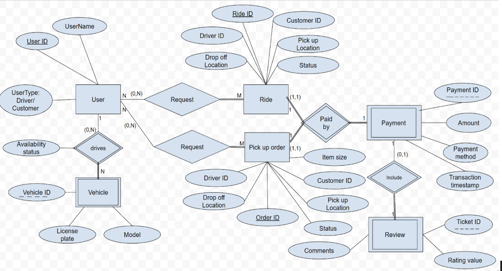
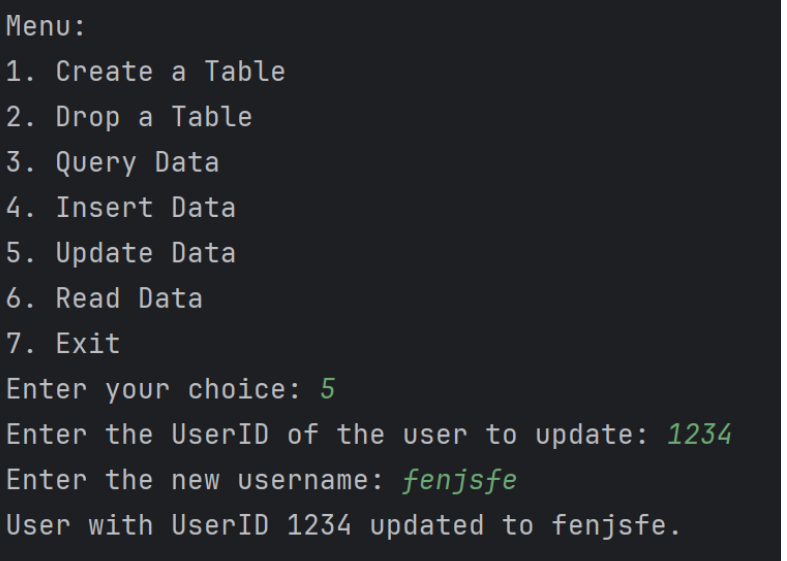
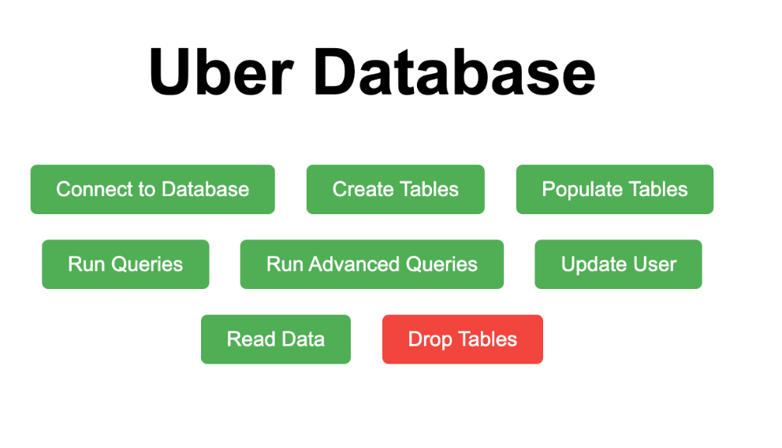

# 🚕 Ride and Pick-Up DBMS

A robust and scalable database system designed to manage a ride-sharing and delivery service. Developed using **Oracle DB**, this project demonstrates advanced SQL queries, normalization (1NF to BCNF), shell scripting for database operations, and optional user interface integration.

---

## 📚 Overview

- **Course**: CPS 510 – Database Systems I  
- **Semester**: Fall 2024  
- **Instructor**: Dr. Abdolreza Abhari  
- **Team Members**: Parnia Zare, Saanika Mahajan, Samantha Lo Papa

---

## 🧠 Key Features

- ER/EER model and schema design
- Full database normalization to BCNF
- SQL queries for creation, retrieval, and analysis
- Unix shell scripting for a text-based DBMS menu
- Optional **web-based GUI** interface via PHP
- Oracle-Python CLI UI for DB management

---

## 🖼️ Screenshots

### 🔶 ER Diagram – Schema Design

Visual representation of database entities, attributes, and relationships.



---

### 🖥️ Unix Shell Interface – Menu and Update Operation

Menu-driven DBMS interface written in shell script.



---

### 🌐 Web GUI Interface (PHP)

Optional graphical interface to perform DBMS operations through a browser.



---

## 🗂️ Full Report

📄 [Ride and Pick-Up DBMS – Detailed Project Report](Ride&PickUp-DBMS.pdf)

Includes:
- Schema design
- Normalization steps
- SQL examples
- Shell script samples
- UI development notes
- System testing results

---

## 🛠️ Technologies Used

- Oracle XE Database
- SQL & PL/SQL
- Bash Shell Scripting
- Python + `oracledb`
- PHP, HTML/CSS (optional GUI)

---

## 🚀 Setup & Installation

### 📥 Requirements
- Oracle XE Database (local)
- Python 3.x with `oracledb` module

```bash
pip install oracledb
